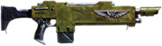
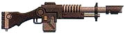
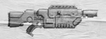
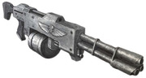
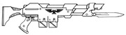
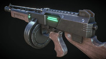
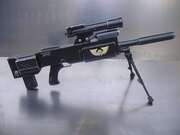

# New Weapons

## Recharging Las Weapons

can be recharged

- in fire/radiation

1 rounds per minute

each 10 minutes roll d100, on roll of 91+ the laspack is destroyed

- in sunlight

1 round per hour, no chance to destroy

- in electrical outlet (jerry rigged) or electoo/potential coils

1 round per minute, every 10 mintes roll a d100, on a roll of 100 the laspack is destroyed

if a proper connection can be made (requiring a tech use/armourer test) then on a roll of 100 the laspack simply stops charging instead and cannot be charged again untill repaired

- via a proper charging station

5 rounds per minute, depending on size can charge multiple packs at once

ideas
toxic.. kinda wtf... cant be recharged
heater, reduce range to 3m, lower damage to d10, add flame and overheat, 10 charges per use
cutter, can be used as a lascutter, 10 charges per use

lasblaster, half range, add scatter, add innaccurate (half way between shotlas and regular las, attachment?)
Fractrix Pattern Assault Laser: sounds like a man portable minigun, light version of multilaser
Kalibrax V-I Pattern Lasrifle - solar auxillia, best quality, probably slightly less than hellgun (also addons, bolt-collimator arrays and induction blast-chargers)

new trait: hefty
if not SB4+, bulging bicep, or braced, -10 to bs (basicly lighter than the -20 version)

## New Lasgun Patterns 

note: base lasgun remove reliable
any lasgun previously aquired is of the Kenteal Pattern M36

### Kantrael Pattern M36

The standard Lasgun pattern used by the Imperial Guard is known as the M35 "M-Galaxy" Pattern, first put into use in 2546.789.M35, although thousands of variant models, marks and patterns exist. The Cadian Shock Troops, for example, commonly bear the M36 Kantrael Pattern Lasrifle, originally manufactured on Kantrael as the name suggests, which is a weapon known for its sheer robustness.

adds reliable

### Lucius No.98 Pattern

The signature weapon of the Death Korps of Krieg, the Lucius-pattern lasgun operates in the 21 megathoule range, but is designed to draw from a standard Munitorum-issue power pack. Consequently, the Lucius lasgun discharges a more powerful shot, but drains the power pack at a correspondingly increased rate. This also puts a great strain on the weapon, limiting the rate of fire and requiring such features as additional heat sink rings lining the exterior of the barrel. Even with such considerations, an over-taxed Lucius lasgun can quickly overheat. The added danger of the weapon overheating does not perturb the famously stoic Krieg.

+2 damage, doubles ammo usage, on overload adds Overheat

### Nihilis Pattern Lasgun

Produced by House Van Saar in the hive city of Necromunda, several of these lasguns were recalled due to logistics errors. Lasguns issued between M35 and M40, with serial numbers 00001475 through 72341110 were recalled as they were originally intended for personal use, but issued to the Astra Militarium by mistake. Issues with these lasguns made them operate outside of normal combat parameters. These included: Above-average Combat Efficacy, Temperamental Machine Spirit, No Bayonet Attachment Point, Unexpected Operator Hair Loss, and Unexpected Operator Death.

+1 damage, if the user rolls doubles on a BS test, roll T or 1 fatigue
### Shotlas

An illegal modification of a standard Lasgun popular amongst the techwrights and armour-mongers of the world of Footfall, the "Shotlas" is rigged to discharge more energy per shot, at the cost of beam coherence, with the weapon's shots swiftly losing power and becoming ineffective at longer ranges.

reduce range to 50m, add scatter, reduce capacity to 20

### Merovech Assault Pattern

Designed purely for close range assaults, the Merovech Pattern Lasgun is heavily reinforced and has a bayonet built into its short and heavy frame. Slots for two power packs are included so the gun can switch to a fresh pack with no reloading. Since the firefights it is designed for are typically over long before two packs are exhausted, it serves its intended function perfectly.

in close combat counts as a spear with mono (pen 2, remove primative)
contains 2 reloads, switching between them is a free action

### Merovech Model 481 "Persuader" Lasguns

Designed for close combat assaults, trench fighting, and urban warfare, the Model 481 "Persuader" Lasgun is a pulsing laser weapon capable of a tremendous rate of fire. Though intended for use by planetary militias and the Imperial Guard, the Persuader has also carved a niche for itself among underworld figures looking for an edge in sheer firepower. The compact size of the Persuader, combined with its high volume of fire, makes it an excellent all-around choice for most combat situations, though its relatively short range can be a liability on an open battlefield. For most, however, its shortcomings are far outweighed by the Persuader’s utility, especially when paired with an oversized "drum" power pack that nearly doubles the weapon's capacity.

upgrade ammo capacity to 100 rounds
reduce range to 50m 
change reload to 2 full
add innaccurate
add storm

### Retribution Pattern Long-las
The first Retribution Pattern Long-Las was reportedly a modified Imperial Guard issue Long-Las, constructed by a sniper belonging to a regiment of the Brontian Longknifes. Angry over the destruction of his regiment in bloody frontal assaults during the Fifth Battle of Koldon Gap, he deserted and proceeded to kill four of his former senior officers and five Commissars before his position was annihilated by a retaliatory mortar strike. In the subsequent centuries, similar weapons have been constructed by various artisans in the Calixis Sector and the Koronus Expanse. The Retribution is a stripped down Long-Las, sacrificing some of the weapon's reliability and clip size. In exchange, the Retribution has a much shorter barrel (for easy concealment) and can be broken into half a dozen pieces that can easily be hidden within a specially designed pack. In addition, the weapon is rigged to fire in a non-visible light spectrum, decreasing penetration slightly but ensuring the Retribution's discharge is unnoticeable. Breaking down or assembling the weapon takes roughly 30 seconds for a practised individual. In addition, there is almost no flash or sound from the las-burst, making it extremely difficult to detect when the Retribution is firing via sight or sound.

uses long las profile
reduce magazine size to 20
remove reliable
if broken down -20 to awareness/scrutiny to spot
-20 to awareness tests to detect and only at half the normal distance

## New Bolt Weapons

